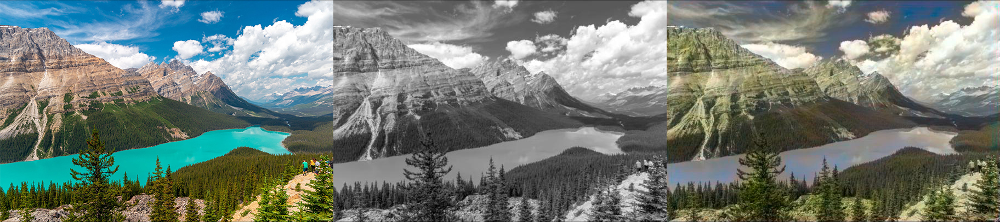
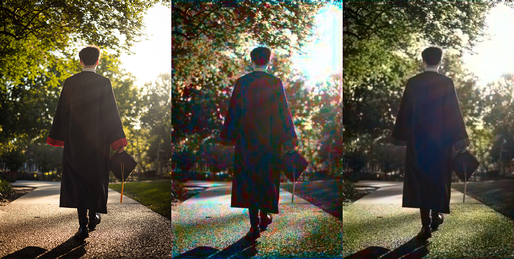
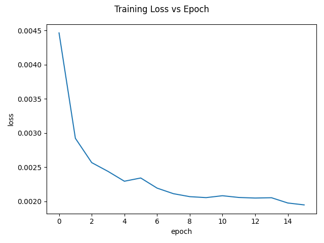
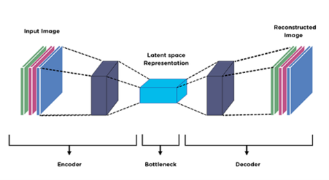

# IMAGE COLORIZATION USING CONVOLUTIONAL AUTOENCODER
### Final project for ECE 371Q - Digital Image Processing

Left: original, Middle: grayscale input, Right: colorized output (from training validation)

Left: original, Middle: model output after epoch 1, Right: output after epoch 16

Training loss after 16 epochs

Autoencoder model